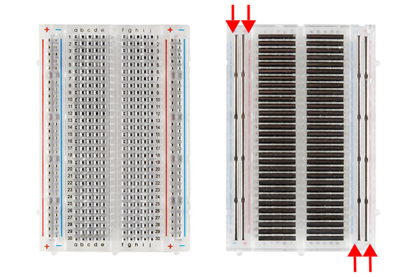
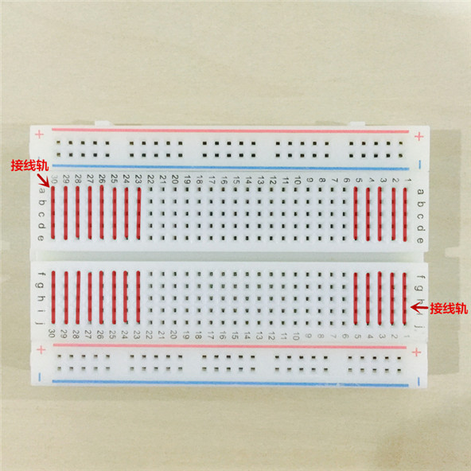
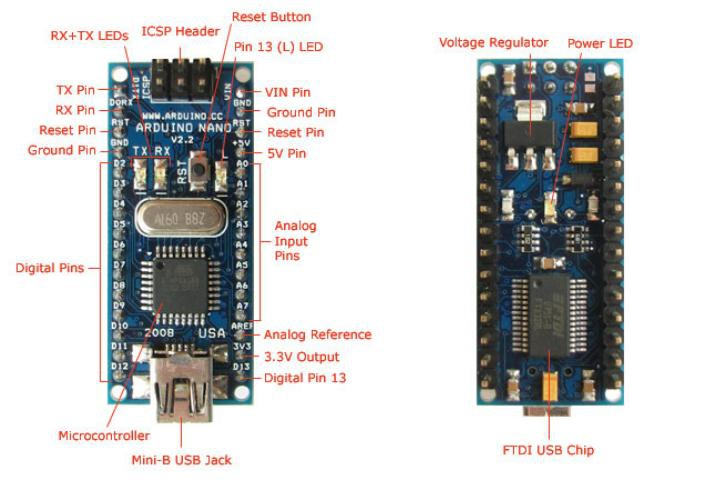

# Lesson 2

## 一 任务

* 初步掌握Arduino nano各引脚作用
* 掌握arduino烧录程序步骤
* 熟悉使用面包板
* 利用nano板点亮LED灯串


## 二 器材

* LED灯串\*1
* Arduino Nano 板 \*1
* USB-micro数据线\*1
* 面板板、排针、杜邦线

## 三 模块介绍

### 1 面包板

#### 介绍

> **面包板**（Breadboard）或叫**免焊万用电路板**（solderless breadboard）是[电子电路设计](https://zh.wikipedia.org/wiki/%E7%94%B5%E5%AD%90%E7%94%B5%E8%B7%AF%E8%AE%BE%E8%AE%A1)中所常用的一种基底。

由于板子上有很多小插孔，各种电子元器件可根据需要任意插入或拔出，免去了焊接的工序，节省了电路的组装时间，且元件可以重复使用，非常适合电子电路的组装、调试和训练。

面包板背面有背胶，方便其贴在不同的仪器上。

​​\


<figure><figcaption></figcaption></figure>

#### 结构

1.  电源轨

    在面包板的上下两侧分别有两列插孔，一般是作为电源引入的通路。上方第一行标有“+”的一列有5组插孔，每组5个（内部5个孔连通），均为正极。上方第二行标有“-”的一列有5组插孔，每组5个（内部5个孔连通），均为接地。面包板下方第一行与第二行结构同上。如需用到整个面包板，通常将“+”与“+”用导线连接起来，“-”与“-”用导线连接起来。

<figure><figcaption></figcaption></figure>


<figure><figcaption></figcaption></figure>


2\. 接线轨

连接孔分为上下两部分，是我们的主工作区，用来插接原件和跳线。在同一列中的5个插孔（即a-b-c-d-e，f-g-h-i-j）是互相连通的；列和列（即1-30）之间以及凹槽上下部分（即e-f）是不连通的。


<figure><figcaption></figcaption></figure>

### 2 Arduino Nano

Arduino Nano结构



我们主要使用Digital Pins

Arduino Nano板需要**电源供电**

有三种方式：

* USB接口：电源电压是稳定的+5V的直流电压。
* 5V Pin：为Arduino开发板供电使用，也可以为外部电子元件提供+5V电源。
* Vin：Vin引脚为Arduino开发板供电时，直流电源电压必须为7V \~ 12V。

## 四 点亮LED灯串

<figure><figcaption><p>5V电压LED灯串</p></figcaption></figure>


代码如下（Adafruit\_NeoPixel的CPP和H文件需要下载在同一个文件夹中）

[Adafruit\_NeoPixel.CPP下载地址](https://github.com/NJURobotClub/arduino\_teaching/blob/main/Adafruit\_NeoPixel.cpp)

[Adafruit\_NeoPixel.h下载地址](https://github.com/NJURobotClub/arduino\_teaching/blob/main/Adafruit\_NeoPixel.h)

[下列ino代码下载地址](https://github.com/NJURobotClub/arduino\_teaching/blob/main/nanoled.ino)

```
#include <SPI.h>
#include "Adafruit_NeoPixel.h"    //引入头文件
#ifdef __AVR__
 #include <avr/power.h> 
#endif

#define LED_PIN    4     //定义信号输出引脚
#define LED_COUNT 18     //定义LED灯个数  
#define ADD true
#define SUB false
#define R1 5
#define R2 6

//RED 0
//ORANGE 10
//YELLO 30
//GREEN 80 
//BLUE 120
//DARKBLUE 150
//PURPLE 190

boolean stat1 = true;     //呼吸状态反转标志
int val = 100;            //呼吸亮度变量
int color = 0;            //色彩改变变量
int count = 0;            //灯珠熄灭时间控制
int temp=0;
int temp2=-1;
Adafruit_NeoPixel strip(LED_COUNT, LED_PIN, NEO_GRB + NEO_KHZ800);//创建灯条对象
uint32_t hsvcolor = strip.ColorHSV(0*256,255, val); //控制颜色

void tail(int);

void setup(){
  Serial.begin(9600);
  strip.begin();           
  //strip.show();

}

void loop(void){
  /*if(temp2>0)              //变色呼吸
  {
    temp=temp+20;
    temp2=-temp2;
  }*/

 tail(80);

  //跑马灯
  //temp=temp+10;  
    
}

void tail(int sideColor){
  
  for(int i = 0; i < LED_COUNT; i ++){
    hsvcolor = strip.ColorHSV(sideColor*256, 255, val);
    //sideColor=sideColor+10;
    strip.setPixelColor(i, hsvcolor);
  }
/*
  //呼吸
  
  if(val>=90)
    stat1 = SUB;
  if(count > 0){
    stat1 = ADD;              
    count = 0;
    temp2=-temp2;
  }
  else if(val<=4){ 
    count ++;
    strip.show();
    return;
  }  
  */    
  strip.show();
/*
  //呼吸
 delay(30);
 if(stat1==SUB) val -= 5;                
 else if(stat1==ADD) val += 5;  
 */
}
```


