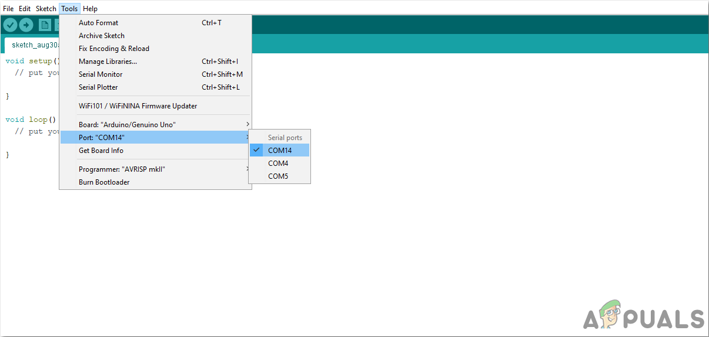
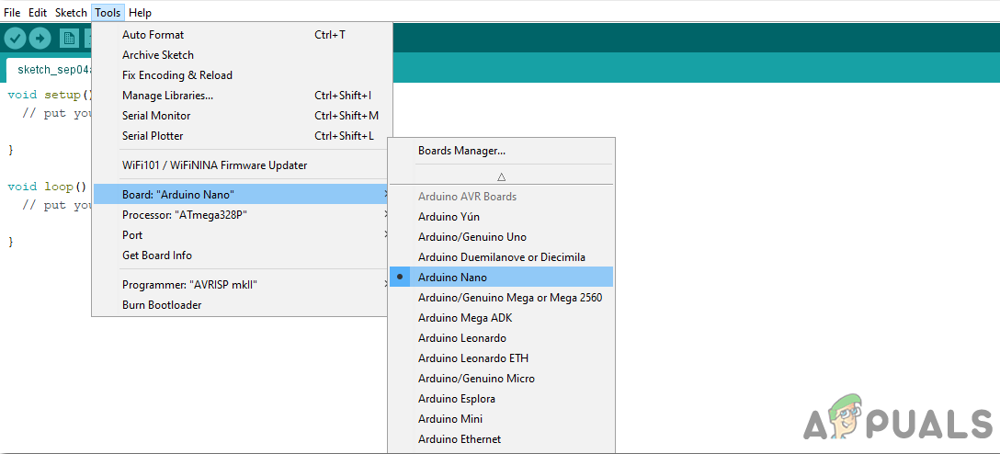

# Arduino下载使用指南

### 下载

Arduino IDE下载：https://www.arduino.cc/en/Main/Software， 根据自己系统类型选择版本，并选择合适的安装路径即可。

### 烧录程序

用Arduino IDE向Arduino Nano板烧录程序，用USB连接Nano板与电脑USB接口

1.点击工具菜单，从下拉菜单中将板设置为Arduino Nano\

<figure><figcaption></figcaption></figure>

2.在同一工具菜单中，将端口设置为端口号

<figure><figcaption></figcaption></figure>

3.在同一工具菜单中，将处理器设置为ATmega328P(旧引导加载程序)。

<figure><figcaption></figcaption></figure>

4.上传程序

<figure><figcaption></figcaption></figure>

<figure><figcaption></figcaption></figure>

### 其他

关于Arduino IDE的其他功能可以参考

https://blog.csdn.net/as480133937/article/details/105331315
