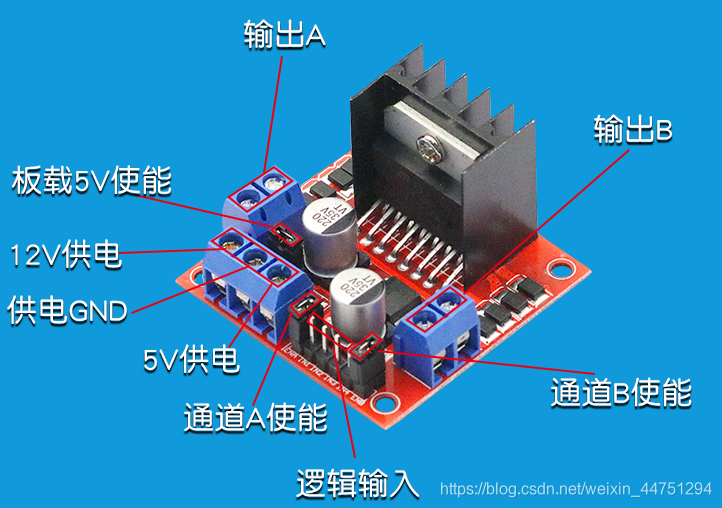
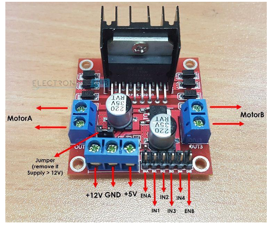
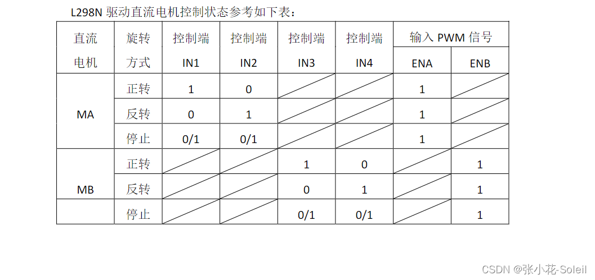

# L298N

### 1.简介

&#x20;      本模块使用ST公司的L298N作为主驱动芯片具有驱动能力强，发热量低，抗干扰能力强的特点，内含两个H桥的高电压大电流全桥式驱动器，可以用来驱动直流电动机和步进电动机、继电器线圈等感性负载；采用标准逻辑电平信号控制模块使用大容量滤波电容和续流保护二极管从而提高可靠性

L298N双H桥驱动模块技术指标：

1.驱动芯片：双H桥直流电机驱动芯片

2\. L298N驱动端供电范围VS：+5V\~ +35V

3\. 驱动板供电范围VS：+7V\~ +35V

4.逻辑部分供电范围VSS：+5V \~ +7V（板内取电+5V）

5.逻辑部分峰值电流范围：0 \~ 36mA

6.最大功耗：20W

7.存储温度：-25°C \~ +130°C


<figure><figcaption></figcaption></figure>

<figure><figcaption></figcaption></figure>

### 2.引脚功能介绍

1\.

**12v供电**：此处是要输入12v，给L298n模块供电，一般用于连接**12v**电池的正级。

2\.

**5V供电**：此处会输出5v电压，一般用于给nano板供电。

3\.

**供电GND**：此处是要接12V电池的负极，另外和**5V供电**处一样，输出一个GND，注意和nano板连接同一个地，否则可能失灵。

4\.

**逻辑输入**：此处有四个引脚分别为 **IN1 IN2 IN3 IN4**,这四个引脚用于控制**输出A**和**输出B**，从而达到电机的正反转。

5\.

**输出A、输出B**：此处有四个引脚分别为 **OUT1 OUT2 OUT3 OUT4**,用于输出不同的电压，使电机正反转。与上述**IN1 IN2 IN3 IN4**相对应。用于连接电机的正负极。

6\.

**通道A使能，通道B使能**：该两处一般有跳线帽，使用时可摘去，两处各连接一个引脚即可，主要用于控制电机的转速。**通道A使能**控制**输出A**所连接电机的转速，**通道B使能**控制**输出B**所连接电机的转速。


### 3使用方法

L298N驱动模块采用标准逻辑电平信号IN1\IN2\IN3\IN4控制；具有两个使能控制端ENA\ENB，在不受输入信号影响的情况下，可（高电平）允许或（低电平）禁止驱动器件工作；L298N芯片可以驱动一台两相步进电机或四相步进电机，也可以驱动两台直流电机。

L298N驱动模块的供电电源：

在独立供电电源接12V供电输入端输入7-12V电源电压时，短接跳线冒处于短接状态，可以通过5V接口接入Arduino开发板向Arduino供5V电。当独立供电电源是12-24V时候，必须拔下短接跳线帽，此时独立供电电源对驱动板逻辑电路电机供电，不对外供电输出。


L298N驱动模块控制直流电机：

直流电机可通过IN1/IN2、IN3/IN4接口输入PWM信号对电机转速进行控制；也可以通过使能端ENA和ENB输入PWM脉宽调制信号对直流电机转速进行调节控制（ENA、ENA短接跳线帽，为5V，电机工作于最高速状态）。

直流电机的正反转控制。信号输入端IN1=HIGH、N2=LOW或者IN1(PWM)>IN2(PWM)，电机MA正转；信号输入端N1=LOW、IN2=HIGH或者IN1(PWM)>IN2(PWM)，电机MA反转。直流电机MB同理。

<figure><figcaption></figcaption></figure>

### 4.实验

#### 4.1实验材料

面包板,L298N,nano板,电池盒,电池,电机,轮子,杜邦线

#### 4.2实验步骤

nano板的D5,D3分别接L298N的IN1,IN2。

nano板5V接L298N的+5V。

电池盒正极接到L298N的+12V，负极和L298N的GND以及nano板的GND共同接地。

烧录程序，测试L298N控制电机转速。

#### 4.3实验代码

```

int IN[2]={5,3};//单片机上的 D5、D3分别连驱动模块上的 IN1、IN2

void motor(int speed1){ //speed1 驱动电机的速度，值范围0-255，255最快
if(speed1>0){ 
s1=0;
s2=1;
} 
else{
s1=1;
s2=0;
} 
digitalWrite(IN[s1],LOW); 
//数字信号写入，给 IN[s1]所代表的端口（D5 或 D3）写入低电平
analogWrite(IN[s2],abs(speed1));
//模拟信号写入，给 IN[s2] 所代表的端口（D3 或 D5）写入一定的电平 

void setup() {
//setup 函数只执行一次

//设置 D5，D3为输出引脚
pinMode(IN[0],OUTPUT);
pinMode(IN[1],OUTPUT);
Serial.begin(9600);//设置波特率，串口之间通信要用的
}

void loop() { 
//loop 函数反复执行

motor（100）;
//更改括号中的值来改变速度
}
```
