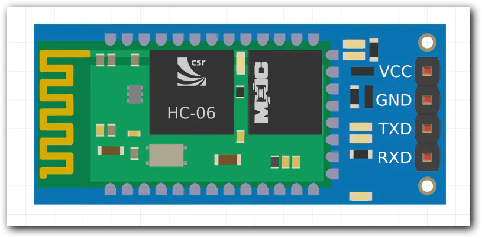
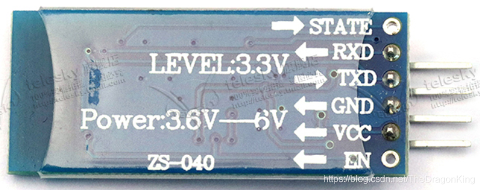

# HC-06蓝牙模块

## 1.0 简介

### 1.1 基本概念

HC-05和HC-06是较为常用的两种蓝牙模块，二者区别在于HC-05是主从一体机，而HC-06只能工作在从机模式下。

主机：用于向从机下发指令，能够搜索从机并主动建立连接的一方。&#x20;

从机：用于接收主机下发的命令，不能主动建立连接，只能等别人连接自己。

主从一体：能够在主机和从机模式间切换，即可做主机也可作从机。

HC-05和HC-06的硬件相同，都采用CSR (Cambridge Silicon Radio) 公司的BC417143芯片，支持蓝牙2.1+EDR规范，只是芯片內部的控制程序不同。

本次实验采用HC-06。

### 1.2 引脚说明

HC-06一共有4个引脚：

VCC接+5V供电（可由nano板的+5V输出）

GND接地

RXD为接收引脚（Receive），接nano板的数字引脚

TXD为发射引脚（Transmit），接nano板的数字引脚

<figure><figcaption></figcaption></figure>

### 1.3 AT模式

六引脚的HC-06模块还可以通过将EN使能端置高电平，从而进入AT模式，实现一些基础功能。但由于社团的HC-06模块均为四引脚，在这里不进行实验。如果感兴趣，可以自行将EN端引脚焊上进行测试。

<figure><figcaption></figcaption></figure>

下面给出AT模式几条常用命令（中间的+不可省略）：

<figure><figcaption></figcaption></figure>

## 2.0 实验材料

* HC-06模块、nano板、USB线、杜邦线、手机、配置有Arduino开发环境的电脑
*   手机端串口通信软件（安卓端尽量选择app）：

    1.微信小程序搜：HC蓝牙BLE串口助手（安卓、IOS通用）

    2.安卓端app：HC蓝牙助手（↓安装包↓）

<mark style="color:red;">下载链接：https://pan.baidu.com/s/1eEDoePRA9P96Jsxb-7LhCQ 提取码：1111</mark>

<mark style="color:red;"></mark>

## 3.0 实验步骤

### 3.1 接线

用MiniUSB线将nano接上电脑，按如下对应关系连接HC-06和nano板：

| HC-06 | Nano |
| :---: | :--: |
|  VCC  |  +5V |
|  GND  |  GND |
|  RXD  |  D2  |
|  TXD  |  D3  |

### 3.2 烧录代码

将以下代码烧录到nano板上

<pre><code>#include &#x3C;SoftwareSerial.h>   //使用软件串口，能将数字口模拟成串口
SoftwareSerial BT(2, 3);  //新建对象，接收脚为D2，发送脚为D3
char val;  //存储接收的变量
void setup() 
{
<strong>  Serial.begin(9600);   //与电脑的串口连接
</strong>  Serial.println("BT is ready!");
  BT.begin(9600);  //设置波特率
<strong>}
</strong>int p;
void loop()
{
  while(BT.available())   //当串口空闲时
  {
    p = BT.parseInt();  //从串口中读入数字
    Serial.print(p);  //将接收到蓝牙模块传来的数据，输出到串口监视器上
    Serial.print("\n");
    if (Serial.read() == "x") //当读到x时结束读取
    {
      break;
    }
  }
}</code></pre>

### 3.3 串口测试

* 板子上电以后，HC-06的指示灯闪烁，进入待连接模式
* 在手机端打开串口通信软件，选择HC-06进行配对，默认配对码为1234
* 连接成功以后，打开Arduino-工具-串口监视器，检查是否出现”BT is ready！“
* 手机端自由发射指令（格式：数字+x），观察串口监视器输出是否与发射指令匹配

## 4.0 总结

本次实验实现了使用HC-06进行简单通信的过程，后续做小车时可以将蓝牙指令和小车动作对应，实现对小车的蓝牙控制。
