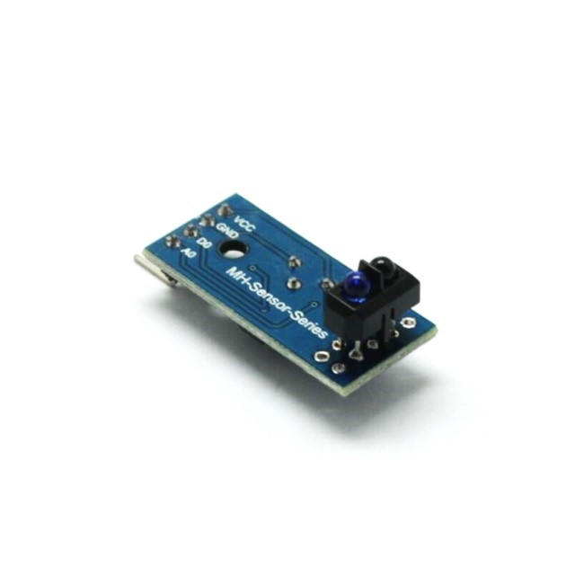

# 循迹模块

## 1.0 模块介绍

### 1.1 名称

循迹模块TCRT5000红外反射传感器

### 1.2 图片

<figure><figcaption></figcaption></figure>

### 1.3 功能

#### 1.31 Vcc和GND

分别接5v接口和地

#### 1.32 D0

TTL开关信号输出

#### 1.33 A0

模拟信号输出（不同距离输出不同电压，此脚一般不接）

#### 1.34 作用原理

传感器的红外发射二极管不断发射红外线，当发射出的红外线没有被反射回来或者反射回来但是强度不够大时，红外接收管一直处于关断状态，此时模块的输出端为高电平，指示二极管一直处于熄灭状态，被检测物体出现在检测范围时，红外线被反射回来且强度足够大，红外接收管饱和，此时模块的输出端为低电平，指示二极管被点亮

## 2.0 操作以及代码示例

### 2.1操作

#### 2.11数量

2个模块，左右各一个

#### 2.12接线

vcc和GND接上相应5v和地，一个模块的A0接arduino板的A5，另一个模块的A0接arduino板的A6

### 2.2代码示例

#### 2.21[代码](https://github.com/NJURobotClub/arduino\_2019/blob/main/week6/xunji.ino)

```
/* 宏定义部分
*******************************************************************/
#define Vo 80// Vo (0-255)
#define k 2     //k (0-10)
/***********************************************************************
*******/
/* 变量声明部分
*****************************************************************/
const int trigPin = 8; // the number of the trigger output pin
const int echoPin = 7; // the number of the echo input pin
////////////////////////////////// variables used for distance calculation 
long duration;                               
int distance; 
float r;
int IN[4]={5,3,6,9};
//单片机上的 D5、D3、D6、D9 分别连驱动模块上的 IN1、IN2、IN3、IN4 
int p1,p2,p;//来反应光强的 
int last_proportional = 0;//上一个比例项 
//long integral = 0;//积分 
int proportional,derivative,power_difference;//比例，导数，差异 
int maxspeed=255;//8 位的芯片 0-255 共 256=2^8 个 
/***********************************************************************
*******
/* 自写函数部分
*****************************************************************/
int readl(){ //read 读取光电管反映的“光强“
p1=analogRead(A6);//读取模拟信号，读取数字信号为 digitalRead（端口）
p2=analogRead(A5); 
p=p1-p2; 
return p;//返回值为“光强差” 
} 
void motor(int speed2,int speed1){ //驱动电机 speed1 右边的速度,speed2 左边的速度 
int s1,s2,s3,s4;
if(speed1<0){//右 
s1=0;
s2=1;
} 
else{
s1=1;
s2=0;
} 
digitalWrite(IN[s1],LOW); 
//数字信号写入，给 IN[s1]所代表的端口（D5 或 D3）写入低电平，高电平为 HIGH 
analogWrite(IN[s2],abs(speed1));
//模拟信号写入，给 IN[s2] 所代表的端口（D3 或 D5）写入一定的电平
if(speed2<0){//左
s3=3;
s4=2;
}
else{
s3=2;
s4=3;
}
digitalWrite(IN[s3],LOW);
//数字信号写入，给 IN[s3]所代表的端口（D6 或 D9）写入低电平，高电平为 HIGH 
analogWrite(IN[s4],abs(speed2));
//模拟信号写入，给 IN[s4] 所代表的端口（D9 或 D6）写入一定的电平
}
void pid(int max_speed){
proportional = readl();//p"光强差"
Serial.println(proportional);
//derivative = proportional-last_proportional;//导数（变化量）
//integral+= proportional;//积分+8
last_proportional = proportional;
power_difference = proportional*k;// + integral/20000 + derivative*3/4; 
//power_difference = proportional*5;
/*这个是学长给的程序，刚开始应有 PID 算法的，后来就只剩下 P（比例了），有兴
趣的
可以把后面加上调参数 PID 指 proportional 比例、integral 积分、derivative 导数 */
if(power_difference > max_speed)
power_difference = max_speed;
if(power_difference < -max_speed)
power_difference = -max_speed;
if(power_difference<0)
motor(max_speed+power_difference,max_speed);//左右 p<0 左拐
else
motor(max_speed,max_speed-power_difference);//左右 p>=0 右拐或不拐
delay(30);
motor(max_speed,max_speed);
}

void find_distance(void)                   
{ 
  digitalWrite(trigPin, LOW);
  delayMicroseconds(2);
  digitalWrite(trigPin, HIGH);
  delayMicroseconds(10);
  digitalWrite(trigPin, LOW);
  duration = pulseIn(echoPin, HIGH, 5000);
  r = 3.4 * duration / 2;                  // calculation to get the measurement in cm using the time returned by the pulsein function.     
  distance = r / 100.00;
  delay(50);
}
void walk(int aim_distance)
{
  distance=0;
  find_distance();
  Serial.println(distance);
  if(distance>aim_distance){
    motor(-100,-100);
  }
  else{
    motor(0,0);
  }
}
/***********************************************************************
*******/
/* 固有两个函数部分
*************************************************************/ 
void setup() {
//setup 函数只执行一次
//设置 D5，D3，D6，D9 为输出引脚，定义输入引脚为 INPUT
/*另外，A5 和 A6 是模拟信号的串口，单片机是不能输出模拟信号，
所以模拟信号串口只能做输入端，故就无需设置了 */ 
pinMode(IN[0],OUTPUT);
pinMode(IN[1],OUTPUT);
pinMode(IN[2],OUTPUT);
pinMode(IN[3],OUTPUT);
pinMode(trigPin, OUTPUT);
pinMode(echoPin, INPUT);
Serial.begin(9600);//设置波特率，串口之间通信要用的，我也不清楚这种东西
}
void loop() { 
//loop 函数反复执行
pid(Vo);
//walk(30);
}

```
